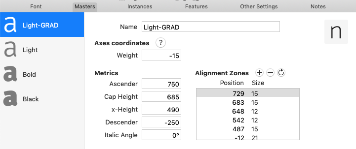
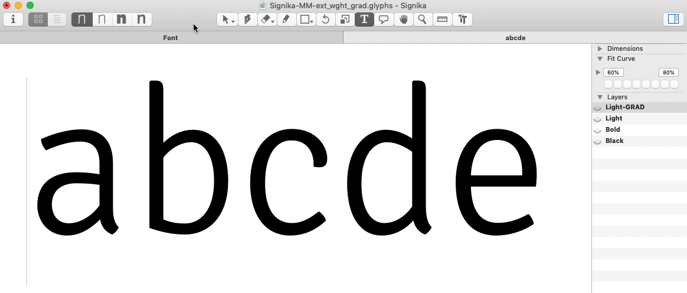

# Making a "proper" GRAD Axis

As the previous doc says, a Grade axis should keep widths and prevent reflow. According to Mozilla Dev Network:

> The term 'grade' refers to the relative weight or density of the typeface design, but differs from traditional 'weight' in that the physical space the text occupies does not change, so changing the text grade doesn't change the overall layout of the text or elements around it.

— [Grade, MDN](https://developer.mozilla.org/en-US/docs/Web/CSS/CSS_Fonts/Variable_Fonts_Guide#Grade)

Signika and Signika Negative have a problem: they don't currently share text width, even though they should. This prevents grade from being used in a truly useful way on the web, where the primary function is likely to be making light/dark UI changes a possibility.

## Goals

1. Make a variable Grade axis happen _without_ reflow, starting by keeping the same weight relationships as the status-quo files (and possibly experiment with adjusting this).
2. Ideally, make the Grade axis happen with just _one_ additional master, to keep font weight down. This may be doable, because the point deltas for grade are so small.

## Approach

1. Taking the `Negative Light` instance, which had a wght value of `-15`, and converting it to a master




2. Using [a glyphs script](https://github.com/thundernixon/Signika/blob/6a36f0dd32c0db964460ab4f4500dcff0c55e24d/scripts/match-metrics.py) to copy glyph metrics from the `Light` master to the `Negative Light` master, to hopefully make point deltas only adjust grade, not overall glyph width, etc




3. Use a glyphs script (not yet written) to copy kerning values from light to light GRAD master
4. Generating a VF and testing the result on bold weights

## Generating the variable font with both axes

	

At first, the VF that is generating is not including the Grade axis. To fix this, I'm trying a number of things:

1.  Adding a custom parameter in the Font Info

   

2. Setting masters as:

| Master     | Weight | Grade |
| ---------- | ------ | ----- |
| Light-GRAD | 0      | 0     |
| Light      | 0      | 100   |
| Bold       | 1000   | 100   |
| Black      | 1350   | 100   |

3. Setting all instances to have Grade value of either `0` or `100`, depending on their normal/negative name


Strangely, so far this is leading FontMake to export a designspace with `GRAD` registered as:

```xml
<axis default="100" maximum="100" minimum="100" name="Grade" tag="GRAD" />
```


4. I have edited the `.designspace` file to 

```xml
<axes>
        <axis default="300" maximum="900" minimum="300" name="Weight" tag="wght">
            <map input="300" output="0" />
            <map input="400" output="291" />
            <map input="600" output="577" />
            <map input="700" output="843" />
            <map input="900" output="1350" />
        </axis>
        <axis default="100" maximum="100" minimum="0" name="Grade" tag="GRAD" />
    </axes>
```

Changing:

- `wght default` to `300`
- adding `input="900"` to AVAR map
- setting `GRAD` min to `0`

5. I will temporarily build from `.designspace` without instances, because these have `wght` values outside of the `min` and `max` (there is a `-15`).

It builds! There are some issues.

Most pressing: the grade axis is so subtle, it barely changes the points in the VF. It's hard to understand why immediately. Is this because...

- Variable TTFs don't export with floating-point precision? (I don't know whether they do or not)?
- The inserted "Grade" Light master was somehow incorrectly extrapolated or processed?

Ahhh the `Light` static instance has a wght value of `50`, while the `Negative Light` has a `wght` value of `-15`. Meanwhile, the VF has a min of `0`, so the Grade axis may not have as far it can travel

### Next Steps

- [x] Insert former `Light` static instance (`wght` 50) as the `Light` master, to give bigger difference between Grade
- [x] extrapolate a *much* lighter grade, and try exporting with that
- [ ] Match weight values for instances of normal and Negative instances
- [ ] See which Glyphs source values must change for a successful export, then maybe script this

- [ ] Push grade axis further to see if it has a better effect on export axes.


### Extrapolate a *much* lighter grade, then try exporting with that

I've extrapolated a very light Grade instance (-300 weight), then made this a master and copied the Light metrics.

I was having issues exporting from FontMake...

```
KeyError: 'wght'
```

```
AssertionError: ((236, [227, 236, 236, 236]), 'int', '.BaseCount', 'BaseArray', '.BaseArray', 'MarkBasePos', '[0]', 'Lookup', '[2]', 'list', '.Lookup', 'LookupList', '.LookupList', 'GPOS', '.table', 'table_G_P_O_S_')
```

...so I'm instead trying to export with GlyphsApp's built-in exporter. This helpfully tells me which glyphs are blocking the export, due to "too many inflection points"


The plugin RedArrows is extremely helpful in locating inflection points and other issues.


I also got an error `**The font contains glyphs with duplicate production names:**` for `commaaccentcomb` and `commaaccent`. I disabled `commaaccentcomb` for now, to get past this.

Unfortunately, Glyphs export seems to be duplicating the Light GRAD master to make a faulty multiple-master VF, where the Bold Negative corner duplicates the Light Negative corner.


- [ ] in the eventual glyphs source, be sure that extrapolated Light GRAD master has better outlines, especially in `a`, `G`, `@`, and resolved `commaaccentcomb` and `commaaccent`.


## Trying with FontMake again

I've set Negative Instances to have weight values matching the positive instances.

However, I'm getting this error from FontMake:

```
AssertionError: Location for axis 'Weight' (mapped to 250.0) out of range for 'Signika Light-GRAD' [300.0..700.0]
```

Probably due to the light masters having a value of `0`, while the light instances have a weight value of `50`.

- [ ] make script to set the designspace in the glyphs file to something more "regular" / gridded

It appears that it may not be possible to export a 2-axis variable font with just 3 masters. Here's a relevant GitHub Issue: https://github.com/googlei18n/fontmake/issues/454#issuecomment-431494121


## FontMaking with corners

Because it seems that a 3-master, 2-axis VF may not currently be possible to export, I make this with 4-masters, simply as a proof of concept. The instance values, kerning, and metadata will still be wrong, but it should work at a basic state.

	

## FontMaking without corners!

I learned on [this FontMake Issue](https://github.com/googlei18n/fontmake/issues/454#issuecomment-431524906) how to accomplish what I intended.

I had the grad-min set as the default, rather than the grad-max. The `GRAD` default must match the Grade of the main masters on the weight axis.

It's now exporting and is 175kb for the TTF, versus the 206kb that 4 masters produced.


This seems to be working well:

    <axes>
        <axis default="300" maximum="750" minimum="300" name="Weight" tag="wght">
            # (I'll be tweaking these map values more, so they're not final)
            <map input="300" output="0" />
            <map input="400" output="360" />
            <map input="600" output="650" />
            <map input="700" output="920" />
            <map input="750" output="1000" />
        </axis>


        #################

        # this is the critical bit – the default *must* match the GRAD of the two main masters for wght, not the GRAD in the min-grade master

        <axis default="100" maximum="100" minimum="0" name="Grade" tag="GRAD" />

        #################

    </axes>

    # here are my 3 sources
    <sources>
        <source familyname="Signika" filename="Signika-Light-GRAD.ufo" name="Signika Light-GRAD" stylename="Light-GRAD">
            <lib copy="1" />
            <groups copy="1" />
            <features copy="1" />
            <info copy="1" />
            <location>
                <dimension name="Weight" xvalue="0" />
                <dimension name="Grade" xvalue="0" />
            </location>
        </source>
        <source familyname="Signika" filename="Signika-Light.ufo" name="Signika Light" stylename="Light">
            <location>
                <dimension name="Weight" xvalue="0" />
                <dimension name="Grade" xvalue="100" />
            </location>
        </source>
        <source familyname="Signika" filename="Signika-Bold.ufo" name="Signika Bold" stylename="Bold">
            <location>
                <dimension name="Weight" xvalue="1000" />
                <dimension name="Grade" xvalue="100" />
            </location>
        </source>
    </sources>